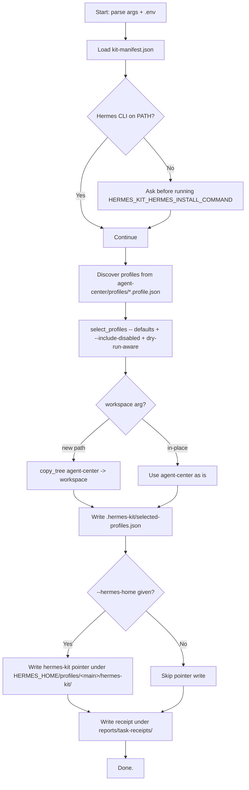

# Architecture (End-to-End)

> Canonical English version of how the kit installs, runs and stays safe. This is the single page to read when you want to understand the system end-to-end. The companion doc [Architecture review (English, GitHub)](https://github.com/rubezhanin/agent-kit/blob/main/docs/ARCHITECTURE_REVIEW.en.md) is the meta-review of the original material; this page is the *current* architecture of the kit.

The kit has three concerns:

1. **Install** — turn a freshly cloned repo into a Hermes-ready workspace, with the right profiles, skills and gating.
2. **Operate** — let the main operator route work to specialists, keep durable state in wiki / reports / Kanban, and stop before anything risky.
3. **Maintain** — keep skills small, find token-drain early, surface receipts, and leave optional integrations (Telegram watcher, userbot, carousel generator) off by default.

```text
                 ┌──────────────────────┐
                 │   Owner / Operator   │
                 └──────────┬───────────┘
                            │ task in chat / Telegram / CLI
                            ▼
       ┌────────────────────────────────────────┐
       │  Gateway / CLI / Direct chat           │  <─ ingress batching, ACK, final closure
       └────────────────┬───────────────────────┘
                        ▼
       ┌────────────────────────────────────────┐
       │        Main operator profile           │  <─ agent-center/AGENTS.md
       │   intake → triage → route → answer     │
       └────┬─────────────┬─────────────┬───────┘
            │             │             │
            ▼             ▼             ▼
       Kanban task   Specialist     Wiki / index
       (long task)   (short task)   (search)
                            │
                            ▼
       ┌────────────────────────────────────────┐
       │   Reports / receipts / audits          │  <─ evidence, not memory
       └────────────────────────────────────────┘
```

---

## 1. Repository layout and what each piece does

```text
hermes-agent/
├── README.md, README.ru.md           # primary docs (EN, RU)
├── LICENSE                           # MIT
├── CHANGELOG.md                      # release notes
├── CONTRIBUTING.md                   # how to send a PR
├── .env.example                      # all knobs, no secrets
├── .gitignore                        # excludes .env, sessions, caches
├── kit-manifest.json                 # machine-readable registry
├── install.ps1, install.sh           # thin shells over setup_kit.py
├── .github/ISSUE_TEMPLATE/           # bug / feature / profile proposal
├── .github/PULL_REQUEST_TEMPLATE.md
├── docs/                             # localized long-form docs
│   └── *.en.md, *.ru.md
├── scripts/
│   ├── setup_kit.py                  # canonical installer
│   └── create_profile_skeleton.py    # new-profile helper
├── agent-center/                     # the workspace that gets installed
│   ├── AGENTS.md                     # main operator contract
│   ├── AGENTS.ru.md
│   ├── config/                       # profile / team / gateway / cron blueprints
│   ├── profiles/                     # *.profile.json — auto-discovered
│   ├── skills/                       # operations / specialists / optional
│   ├── prompts/                      # short system prompts
│   ├── templates/                    # receipt / task / smoke-test forms
│   ├── kanban/                       # board contract
│   ├── owner-context/                # private owner notes (start empty)
│   ├── references/                   # long sources brought into the kit
│   ├── reports/                      # receipts, audits, health (gitignored)
│   ├── integrations/                 # optional integrations
│   │   ├── telegram-channel-intelligence/
│   │   └── carousel-creator/
│   ├── wiki/                         # canonical source of truth
│   │   ├── operating-contract.md
│   │   ├── architecture.md
│   │   ├── team-roster.md
│   │   ├── memory-policy.md
│   │   ├── security-checklist.md     # new (from source/)
│   │   ├── context-management.md     # new (from source/)
│   │   └── local-embedding.md        # new (from source/)
│   └── wiki/                         # canonical knowledge layer
└── source/                           # upstream MD-packs (reference only)
```

`source/` is **read-only material** from upstream; it is not loaded by the kit at runtime. The kit imports what it needs into `wiki/`, `references/`, `skills/`, `prompts/`.

---

## 2. The manifest, the profiles, and why auto-discovery matters

`kit-manifest.json` is the single source of truth the installer reads:

| Field | Use |
| --- | --- |
| `name`, `version` | Kit identity and release marker. |
| `agent_center` | Subdirectory that becomes the workspace. |
| `profile_registry` | Where to look for `*.profile.json` files. |
| `skills_root` | Where to look for `SKILL.md` files. |
| `default_profiles` | List of profile slugs enabled by default. |
| `disabled_by_default` | Hard opt-in profiles. |
| `hermes.candidate_commands` | What `which` looks for to find Hermes. |
| `installer.dry_run_supported` | Lets CI / previews run the installer safely. |
| `installer.profile_auto_discovery` | New profiles appear without code change. |

### Auto-discovery: why it's the design choice

```python
# scripts/setup_kit.py (excerpt)
def discover_profiles(profile_dir: Path) -> list[dict]:
    profiles = []
    for path in sorted(profile_dir.glob("*.profile.json")):
        data = load_json(path)
        data["_source_file"] = str(path)
        profiles.append(data)
    return profiles
```

Adding a new profile is "drop a file". The installer picks it up on the next run. No edits to `setup_kit.py`, no PR to the installer, no re-release of the kit. The same mechanism works for skills (`agent-center/skills/**/SKILL.md`) — the main operator loads them only when a trigger matches.

This is the *boring default* answer to "how do I add a new agent?".

---

## 3. Installation flow

### 3.1 Entry points

```text
install.ps1 (PowerShell) ─┐
install.sh  (POSIX)     ─┼─► python scripts/setup_kit.py [...flags]
python -m setup_kit     ─┘
```

All three shells just hand a list of CLI flags to `setup_kit.py`. Flags override env vars, env vars override `kit-manifest.json` defaults.

Useful flags:

| Flag | Purpose |
| --- | --- |
| `--dry-run` | Print every action; write nothing. |
| `--yes` | Auto-accept safe prompts (still asks before external side-effects). |
| `--workspace PATH` | Install into a different workspace. |
| `--hermes-home PATH` | Where Hermes lives, if known. |
| `--main-profile NAME` | Override `main-operator`. |
| `--install-hermes` | Allow running the install command for Hermes itself. |
| `--hermes-install-command "..."` | The command to install Hermes when missing. |
| `--include-disabled` | Also offer `disabled-by-default` profiles (e.g. `telegram-channel-watcher`, `carousel-creator`). |

### 3.2 What `setup_kit.py` does, step by step



The dry-run path is dry at every step:

- profile selection uses `default_enabled` instead of asking the user;
- `copy_tree` prints `COPY: ...` and returns without touching the filesystem;
- `selected-profiles.json` is printed as `WOULD WRITE:` instead of being written;
- the receipt is printed, not written.

### 3.3 Where the installer never writes

- It does **not** touch your existing `<HERMES_HOME>/config.yaml` or any production Hermes config. The pointer write goes only into a new `hermes-kit/` subfolder.
- It does **not** write outside `agent-center/` (or your `--workspace`), as long as `HERMES_KIT_LOCK_OUTSIDE_WORKSPACE=true` (default).
- It does **not** call `subprocess` from a value it found in env when `HERMES_KIT_REFUSE_SHELL_FROM_ENV=true` (default).

---

## 4. Runtime architecture (what runs after install)

Once `--install` (or in-place `setup_kit.py`) finishes, the runtime is:

```text
Owner / Operator
   │
   ▼
Gateway / CLI / Direct chat
   │   ◄─ ingress batching, early ACK, final closure (gateway-ux)
   ▼
Main Operator profile  (AGENTS.md)
   │   ◄─ source-of-truth layers (wiki / references / owner-context / reports)
   │
   ├──► Direct answer (simple)
   ├──► Kanban task + specialist (long)
   │
   ▼
Reports / Receipts / Audits
```

### 4.1 Main operator — `main-operator`

- Reads `agent-center/AGENTS.md` (canonical English) or `.ru.md` (Russian).
- Loads the [`origin-return-protocol`](../agent-center/skills/operations/origin-return-protocol/SKILL.md) skill: every task carries the five anchors (`origin` / `owner` / `artifact` / `status` / `return_path`).
- Triages every request: simple / fact / technical / long / risk / external.
- Routes to:
  - `wiki-memory` for source-of-truth lookups,
  - `researcher` / `technical-engineer` / `business-analyst` / ... for short tasks,
  - `kanban-operator` for durable tasks,
  - **NEEDS_APPROVAL** for anything sensitive (see Stop rules in `AGENTS.md`).
- Always returns the Origin Return summary (`Status / Outcome / Artifact / Verification / Returned to / Blocked`) through `return_path`. Never claims `DONE` until the result reached `return_path`.

### 4.2 Source-of-truth layering

The main operator never treats retrieval results as truth. The layering is enforced by `agent-center/wiki/memory-policy.md` and operationalized by the `wiki-memory` skill.

```text
            ┌─────────────────────────────────────────┐
            │      durable memory (short facts)        │  ──► stable prefs only
            └─────────────────────────────────────────┘
                       ▲          ▲
                       │          │ (rare, owner-approved)
   ┌─────────────────────────────────────────────────────────┐
   │           wiki/  (canonical, write = approval)         │  ──► truth
   └─────────────────────────────────────────────────────────┘
   ┌─────────────────────────────────────────────────────────┐
   │           references/ (long sources, local)            │  ──► read-only
   └─────────────────────────────────────────────────────────┘
   ┌─────────────────────────────────────────────────────────┐
   │           reports/ (receipts, audits, evidence)         │  ──► evidence, not truth
   └─────────────────────────────────────────────────────────┘
   ┌─────────────────────────────────────────────────────────┐
   │           memory index (read-only, top_k=5)             │  ──► search
   └─────────────────────────────────────────────────────────┘
```

### 4.3 Specialists

| Role | Default | Purpose | Stop rule |
| --- | --- | --- | --- |
| `researcher` | active | Public-source research, source ledger, Telegram candidate discovery. | Verifies every claim against a path. |
| `technical-engineer` | active | Setup, diagnostics, bounded local changes. | Never touches production / secrets without approval. |
| `business-analyst` | active | Process map, feasibility, pilot design. | No production automation without approval. |
| `methodologist` | active | Guides, courses, knowledge packaging. | No invented facts. |
| `marketer` | active | Audience, offer, proof bank. | No publish / spend without proof + legal-ops review. |
| `designer` | active | Visual brief, prompt pack. | No external generation with private assets. |
| `legal-ops` | active risk-review | Contract / claim / privacy review. | Not legal advice; escalate to lawyer. |
| `economist` | active risk-review | ROI / pricing / budget review. | Never moves money. |
| `profile-factory` | active operations | New profiles / skills / smoke tests. | Never creates a live profile without dry-run + approval. |
| `agent-creator` | on-demand | Helper-agent design. | Dry-run + change packet + smoke. |
| `psychological-support` | disabled | Supportive, non-clinical conversation. | Separate safety review before enabling. |
| `telegram-channel-watcher` | disabled | Read-only watcher for approved channels. | TDLib preferred; never uses owner's main account. |
| `carousel-creator` | disabled | Brand carousel / GPT image prompts. | No publish; OTK before shipping. |

Every specialist is gated by the same `task brief` template:

```text
# Task brief
- Goal
- Context
- Sources of truth
- Allowed data / paths
- Forbidden data / paths
- Tools allowed
- Side-effect policy
- Output format
- Verification
- Stop rules
```

### 4.4 Operations skills

Operations skills are not agents, they are repeatable procedures the main operator calls on demand:

| Skill | Calls when |
| --- | --- |
| `agent-creator` | Owner asks for a new helper-agent. |
| `profile-factory` | Owner asks for a new profile. |
| `wiki-memory` | Knowledge lookups. |
| `kanban-operator` | Long tasks handoff. |
| `gateway-ux` | Gateway behaviour review. |
| `skill-hygiene-audit` | Weekly check. |
| `hermes-token-drain-diagnostic` | Token-cost spikes. |
| `telegram-channel-intelligence` | Channel research + watcher policy. |
| `carousel-creator` | Brand carousel workflow. |

### 4.5 Kanban (when available)

Kanban is durable execution, not chat memory. The contract is in `agent-center/kanban/board-contract.md`:

- Cards have: title, goal, status, assignee, priority, dependencies, allowed/forbidden paths, expected output, verification, receipt path, blocker/approval.
- Statuses: `triage → todo → ready → running → blocked → review → done → archived`.
- When unavailable: do **not** fake it. Use `reports/task-receipts/` as a temporary log.

### 4.6 Optional integrations

Integrations stay off until you flip them on — installer never enables them by default:

- `integrations/telegram-channel-intelligence/` — see `README.md` and `watcher-policy.yaml`.
- `integrations/carousel-creator/` — see `README.md` and the upstream pack at `source/specialists/chatgpt-carousel-agent-kit/`.

---

## 5. Data flow for a typical request

Let's trace "Should we add this Telegram channel to the watcher?":

```text
1. Owner sends a Telegram message.
2. Gateway (gateway-ux) batches it with anything within the debounce window.
   - Early ACK is sent for visible work (skill load, source lookup).
3. Main operator reads AGENTS.md, identifies the request as Telegram-related
   and routes to researcher.
4. Researcher (skill telegram-channel-intelligence) searches, returns a
   candidate list, never joins anything.
5. Main operator returns the candidate list to the owner with the exact
   "approval snippet" expected by the watcher policy:
       I approve monitoring: @channel_a, @channel_b
6. Owner replies with the approved list.
7. technical-engineer prepares a dry-run for watcher setup.
8. Owner approves the watcher setup.
9. technical-engineer writes the watcher config; receipt lands in
   reports/task-receipts/.
10. Watcher begins read-only monitoring.
11. Summary outputs land in
    integrations/telegram-channel-intelligence/reports/.
```

Each step produces evidence: a search log, a candidate list, a watcher config diff, an install receipt.

---

## 6. Maintenance loop

The kit ships a blueprint in `agent-center/config/cron-jobs.yaml`. Recommended cadence:

| Cadence | Job | Mode |
| --- | --- | --- |
| Daily | `daily-health-report` | read-only |
| Weekly | `weekly-skills-hygiene-audit` | read-only |
| Weekly or on symptom | `weekly-token-drain-diagnostic` | read-only |
| Weekly | `kanban-gc-and-stats` | read-only, then approval |
| Daily | `nightly-worklog-digest` | report-only |

All five jobs default to **read-only** or **report-only**. Any mutating action requires a separate owner approval.

---

## 7. Threat model and safety rails

The kit assumes the threat model in `wiki/security-checklist.md`. Highlights:

- **OWASP LLM Top 10.** Each top item has a concrete mitigation inside the kit.
- **MCP supply chain.** All skills are first-party; third-party skills go through `profile-factory` approval.
- **Secrets.** `.env`-only, never in chat, never in commits.
- **Gateway exposure.** Bound to `localhost` / private LAN by default.
- **Telegram watcher.** Disabled by default; TDLib preferred; never uses owner's main account.

The `.env.example` exposes `HERMES_KIT_SAFETY_LEVEL` (`strict` / `balanced` / `permissive`) and `HERMES_KIT_LOCK_OUTSIDE_WORKSPACE` so the safety stance is configurable per-deployment, not buried in code.

---

## 8. Adding a new profile, skill or integration

This is the boring part:

1. Drop `agent-center/profiles/<slug>.profile.json`.
2. Drop `agent-center/skills/<group>/<slug>/SKILL.md` with frontmatter `name` / `description`.
3. (Optional) Drop a smoke test under `agent-center/templates/`.
4. Update `agent-center/skills/README.md` and `docs/AGENT_SKILL_MATRIX.en.md`.
5. Run `python scripts/setup_kit.py --dry-run --include-disabled` to confirm the installer sees it.
6. Send a PR following `.github/PULL_REQUEST_TEMPLATE.md`.

No installer code change required.

---

## 9. Where to read more

| Page | Purpose |
| --- | --- |
| `README.md` | Quick start and links. |
| `docs/GITHUB_INSTALL.en.md` | Installer reference. |
| `docs/ONE_FILE_HERMES_KIT_INSTALLER.en.md` | Dialog flow for a clean Hermes agent. |
| `docs/ADDING_PROFILES.en.md` | Schema and a worked example. |
| `docs/AGENT_SKILL_MATRIX.en.md` | Agent × skill matrix. |
| `docs/ARCHITECTURE_REVIEW.en.md` | Meta-review of the original material. |
| `docs/IMPLEMENTATION_PLAN.en.md` | Phased rollout plan. |
| `docs/SOURCE_SELECTION.en.md` | Why each `source/` file is or is not in `agent-center/`. |
| `agent-center/AGENTS.md` | Main operator contract. |
| `agent-center/wiki/security-checklist.md` | Security stance. |
| `agent-center/wiki/context-management.md` | Context hygiene. |
| `agent-center/wiki/local-embedding.md` | Memory-index contract. |
| `agent-center/kanban/board-contract.md` | Kanban contract. |
| `agent-center/config/*.yaml` | Blueprints (gateway, profiles, cron, hermes-target). |
| `agent-center/integrations/telegram-channel-intelligence/README.md` | Telegram policy. |
| `agent-center/integrations/carousel-creator/README.md` | Carousel pack adapter. |