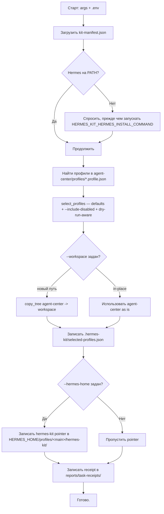

# Архитектура (end-to-end)

> Русская локализация. Канонический английский — [Architecture (English, GitHub)](https://github.com/rubezhanin/agent-kit/blob/main/docs/ARCHITECTURE.en.md).

У набора три задачи:

1. **Установить** — превратить свежий clone в Hermes-ready workspace с правильными профилями, навыками и gating.
2. **Работать** — main operator маршрутизирует задачи на специалистов, держит durable state в wiki / reports / Kanban и останавливается перед рискованными действиями.
3. **Поддерживать** — держать skills маленькими, ловить token-drain на ранней стадии, формировать receipts, держать опциональные интеграции (Telegram watcher, userbot, генератор каруселей) выключенными по умолчанию.

```text
                 ┌──────────────────────┐
                 │   Владелец / оператор│
                 └──────────┬───────────┘
                            │ задача в чат / Telegram / CLI
                            ▼
       ┌────────────────────────────────────────┐
       │  Gateway / CLI / Direct chat           │  ← ingress batching, ACK, final closure
       └────────────────┬───────────────────────┘
                        ▼
       ┌────────────────────────────────────────┐
       │        Профиль main operator           │  ← agent-center/AGENTS.md
       │   intake → triage → route → answer     │
       └────┬─────────────┬─────────────┬───────┘
            │             │             │
            ▼             ▼             ▼
        Kanban-задача  Специалист   Wiki / index
        (длинная)     (короткая)   (поиск)
                            │
                            ▼
       ┌────────────────────────────────────────┐
       │   Reports / receipts / audits          │  ← доказательства, не память
       └────────────────────────────────────────┘
```

---

## 1. Структура репозитория

```text
hermes-agent/
├── README.md, README.ru.md           # основная документация (EN, RU)
├── LICENSE                           # MIT
├── CHANGELOG.md                      # release notes
├── CONTRIBUTING.md                   # правила PR
├── .env.example                      # все настройки, без секретов
├── .gitignore                        # исключает .env, сессии, кэши
├── kit-manifest.json                 # машиночитаемый registry
├── install.ps1, install.sh           # тонкие обёртки над setup_kit.py
├── .github/ISSUE_TEMPLATE/           # bug / feature / profile proposal
├── .github/PULL_REQUEST_TEMPLATE.md
├── docs/                             # локализованная длинная документация
│   └── *.en.md, *.ru.md
├── scripts/
│   ├── setup_kit.py                  # канонический установщик
│   └── create_profile_skeleton.py    # помощник для новых профилей
├── agent-center/                     # workspace, который ставится
│   ├── AGENTS.md                     # контракт main operator
│   ├── AGENTS.ru.md
│   ├── config/                       # blueprints (профили / команда / gateway / cron)
│   ├── profiles/                     # *.profile.json — авто-обнаружение
│   ├── skills/                       # operations / specialists / optional
│   ├── prompts/                      # короткие system prompt'ы
│   ├── templates/                    # receipt / task / smoke-test формы
│   ├── kanban/                       # контракт доски
│   ├── owner-context/                # приватные заметки владельца (изначально пусто)
│   ├── references/                   # длинные источники, принесённые в kit
│   ├── reports/                      # receipts, audits, health (в .gitignore)
│   ├── integrations/                 # опциональные интеграции
│   │   ├── telegram-channel-intelligence/
│   │   └── carousel-creator/
│   ├── wiki/                         # канонический source of truth
│   └── source/                       # upstream MD-pack'и (reference only)
└── source/                           # upstream MD-pack'и (reference only)
```

`source/` — это **read-only материал** из upstream; в рантайме kit его не грузит. Kit импортирует то, что нужно, в `wiki/`, `references/`, `skills/`, `prompts/`.

---

## 2. Манифест, профили и зачем нужна авто-обнаружение

`kit-manifest.json` — единый источник правды, который читает установщик:

| Поле | Назначение |
| --- | --- |
| `name`, `version` | Идентичность набора и маркер релиза. |
| `agent_center` | Подкаталог, который становится workspace. |
| `profile_registry` | Где искать `*.profile.json`. |
| `skills_root` | Где искать `SKILL.md`. |
| `default_profiles` | Профили, включённые по умолчанию. |
| `disabled_by_default` | Тяжёлый opt-in. |
| `hermes.candidate_commands` | Кого `which` ищет, чтобы найти Hermes. |
| `installer.dry_run_supported` | Позволяет гонять в CI / превью безопасно. |
| `installer.profile_auto_discovery` | Новые профили появляются без правки кода. |

### Авто-обнаружение: почему это выбор дизайна

```python
# scripts/setup_kit.py (выдержка)
def discover_profiles(profile_dir: Path) -> list[dict]:
    profiles = []
    for path in sorted(profile_dir.glob("*.profile.json")):
        data = load_json(path)
        data["_source_file"] = str(path)
        profiles.append(data)
    return profiles
```

Добавить новый профиль — «положи файл». Установщик подхватывает его при следующем запуске. Без правок `setup_kit.py`, без PR в установщик, без нового релиза. То же самое работает для skills (`agent-center/skills/**/SKILL.md`) — main operator подгружает их только когда срабатывает триггер.

Это **скучный дефолтный** ответ на вопрос «как мне добавить нового агента?».

---

## 3. Установка (пошагово)

### 3.1 Entry points

```text
install.ps1 (PowerShell) ─┐
install.sh  (POSIX)     ─┼─► python scripts/setup_kit.py [...флаги]
python -m setup_kit     ─┘
```

Все три оболочки просто передают набор CLI-флагов в `setup_kit.py`. Флаги перекрывают env vars, env vars перекрывают дефолты из `kit-manifest.json`.

Полезные флаги:

| Флаг | Назначение |
| --- | --- |
| `--dry-run` | Печатает все действия, ничего не пишет. |
| `--yes` | Авто-принятие безопасных дефолтов (внешние эффекты всё равно спрашиваются). |
| `--workspace PATH` | Установить в другой workspace. |
| `--hermes-home PATH` | Где живёт Hermes, если известно. |
| `--main-profile NAME` | Переопределить `main-operator`. |
| `--install-hermes` | Разрешить запуск команды установки Hermes. |
| `--hermes-install-command "..."` | Команда для установки Hermes, если его нет. |
| `--include-disabled` | Также предложить `disabled-by-default` профили (например, `telegram-channel-watcher`, `carousel-creator`). |

### 3.2 Что делает `setup_kit.py` пошагово



Dry-run полностью без записи:

- profile selection использует `default_enabled` вместо вопросов пользователю;
- `copy_tree` печатает `COPY: ...` и возвращается без касания ФС;
- `selected-profiles.json` печатается как `WOULD WRITE:` вместо записи;
- receipt печатается, а не пишется.

### 3.3 Куда установщик не пишет

- Не трогает существующий `<HERMES_HOME>/config.yaml` или production-конфиг Hermes. Запись pointer'а идёт только в новый подкаталог `hermes-kit/`.
- Не пишет за пределами `agent-center/` (или `--workspace`), пока `HERMES_KIT_LOCK_OUTSIDE_WORKSPACE=true` (по умолчанию).
- Не вызывает `subprocess` от значения из env, пока `HERMES_KIT_REFUSE_SHELL_FROM_ENV=true` (по умолчанию).

---

## 4. Архитектура рантайма

После установки рантайм выглядит так:

```text
Owner / Operator
   │
   ▼
Gateway / CLI / Direct chat
   │   ◄─ ingress batching, early ACK, final closure (gateway-ux)
   ▼
Main Operator profile  (AGENTS.md)
   │   ◄─ source-of-truth слои (wiki / references / owner-context / reports)
   │
   ├──► Прямой ответ (простое)
   ├──► Kanban-задача + специалист (длинное)
   │
   ▼
Reports / Receipts / Audits
```

### 4.1 Main operator — `main-operator`

- Читает `agent-center/AGENTS.md` (канонический англ.) или `.ru.md`.
- Подгружает навык [`origin-return-protocol`](../agent-center/skills/operations/origin-return-protocol/SKILL.md): каждая задача несёт пять якорей (`origin` / `owner` / `artifact` / `status` / `return_path`).
- Триаж каждого запроса: простой / факт / техника / длинный / риск / внешний.
- Маршрутизирует на:
  - `wiki-memory` для source-of-truth,
  - `researcher` / `technical-engineer` / `business-analyst` / ... для коротких задач,
  - `kanban-operator` для durable-задач,
  - **NEEDS_APPROVAL** для всего чувствительного (см. Stop rules в `AGENTS.md`).
- Всегда возвращает Origin Return summary (`Status / Outcome / Artifact / Verification / Returned to / Blocked`) через `return_path`. Никогда не ставит `DONE`, пока результат не дошёл до `return_path`.

### 4.2 Слои source-of-truth

Main operator никогда не считает retrieval истиной. Слои зафиксированы в `agent-center/wiki/memory-policy.md` и реализуются скиллом `wiki-memory`.

```text
            ┌─────────────────────────────────────────┐
            │      durable memory (короткие факты)   │  ──► только стабильные prefs
            └─────────────────────────────────────────┘
                       ▲          ▲
                       │          │ (редко, owner-approved)
   ┌─────────────────────────────────────────────────────────┐
   │           wiki/  (канон, запись = approval)             │  ──► правда
   └─────────────────────────────────────────────────────────┘
   ┌─────────────────────────────────────────────────────────┐
   │           references/ (длинные источники, локально)      │  ──► read-only
   └─────────────────────────────────────────────────────────┘
   ┌─────────────────────────────────────────────────────────┐
   │           reports/ (receipts, audits, evidence)         │  ──► доказательства, не правда
   └─────────────────────────────────────────────────────────┘
   ┌─────────────────────────────────────────────────────────┐
   │           memory index (read-only, top_k=5)             │  ──► поиск
   └─────────────────────────────────────────────────────────┘
```

### 4.3 Специалисты

| Роль | По умолчанию | Назначение | Stop-rule |
| --- | --- | --- | --- |
| `researcher` | active | Публичные источники, source ledger, поиск Telegram-каналов. | Каждый claim подтверждается путём. |
| `technical-engineer` | active | Setup, диагностика, ограниченные локальные правки. | Не трогает production / секреты без approval. |
| `business-analyst` | active | Process map, feasibility, дизайн пилота. | Никакой production automation без approval. |
| `methodologist` | active | Гайды, курсы, упаковка знаний. | Без выдуманных фактов. |
| `marketer` | active | Аудитория, оффер, proof bank. | Не публикует / не тратит без proof + legal-ops review. |
| `designer` | active | Visual brief, prompt pack. | Не делает внешнюю генерацию с приватными ассетами. |
| `legal-ops` | active risk-review | Контракты / claims / privacy. | Не юридический совет; эскалация на юриста. |
| `economist` | active risk-review | ROI / pricing / бюджет. | Не двигает деньги. |
| `profile-factory` | active operations | Новые профили / skills / smoke tests. | Без dry-run + approval не создаёт живой профиль. |
| `agent-creator` | on-demand | Дизайн helper-агентов. | Dry-run + change packet + smoke. |
| `psychological-support` | disabled | Поддерживающая, неклиническая беседа. | Отдельный safety review перед включением. |
| `telegram-channel-watcher` | disabled | Read-only watcher одобренных каналов. | TDLib предпочтительно; не использовать main-аккаунт владельца. |
| `carousel-creator` | disabled | Брендовая карусель / GPT image prompts. | Без publish; OTK перед отгрузкой. |

Каждый специалист работает через единый шаблон `task brief`:

```text
# Task brief
- Goal
- Context
- Sources of truth
- Allowed data / paths
- Forbidden data / paths
- Tools allowed
- Side-effect policy
- Output format
- Verification
- Stop rules
```

### 4.4 Operations-навыки

Это не агенты, а повторяемые процедуры:

| Навык | Когда вызывается |
| --- | --- |
| `agent-creator` | Владелец просит нового helper-агента. |
| `profile-factory` | Владелец просит новый профиль. |
| `wiki-memory` | Поиск знаний. |
| `kanban-operator` | Handoff длинной задачи. |
| `gateway-ux` | Ревью поведения gateway. |
| `skill-hygiene-audit` | Еженедельная проверка. |
| `hermes-token-drain-diagnostic` | Спады расхода токенов. |
| `telegram-channel-intelligence` | Channel research + watcher policy. |
| `carousel-creator` | Бренд-карусель workflow. |

### 4.5 Kanban (когда доступен)

Kanban — durable execution, а не память чата. Контракт в `agent-center/kanban/board-contract.md`:

- У карточки есть: title, goal, status, assignee, priority, dependencies, allowed/forbidden paths, expected output, verification, receipt path, blocker/approval.
- Статусы: `triage → todo → ready → running → blocked → review → done → archived`.
- Когда недоступно: не фабриковать. Использовать `reports/task-receipts/` как временный лог.

### 4.6 Опциональные интеграции

Интеграции остаются выключенными, пока вы их сами не включите — установщик их **не** активирует:

- `integrations/telegram-channel-intelligence/` — см. `README.md` и `watcher-policy.yaml`.
- `integrations/carousel-creator/` — см. `README.md` и upstream-пакет в `source/specialists/chatgpt-carousel-agent-kit/`.

---

## 5. Типичный поток данных: «Добавить Telegram-канал в watcher?»

```text
1. Владелец шлёт сообщение в Telegram.
2. Gateway (gateway-ux) батчит его со всем, что пришло в debounce-окне.
   - Early ACK на видимую работу (загрузка skill, поиск источников).
3. Main operator читает AGENTS.md, понимает, что запрос про Telegram,
   и маршрутизирует его на researcher.
4. Researcher (skill telegram-channel-intelligence) делает поиск,
   возвращает candidate-list и никуда не вступает.
5. Main operator возвращает владельцу candidate-list со снипетом approval,
   как требует watcher policy:
       I approve monitoring: @channel_a, @channel_b
6. Владелец отвечает списком одобренных каналов.
7. technical-engineer готовит dry-run для настройки watcher'а.
8. Владелец одобряет настройку watcher'а.
9. technical-engineer пишет конфиг watcher'а; receipt уезжает в
   reports/task-receipts/.
10. Watcher стартует read-only мониторинг.
11. Сводки уходят в integrations/telegram-channel-intelligence/reports/.
```

Каждый шаг оставляет evidence: лог поиска, candidate-list, diff конфига watcher'а, install-receipt.

---

## 6. Контур обслуживания

Blueprint в `agent-center/config/cron-jobs.yaml`. Рекомендованный ритм:

| Cadence | Задача | Mode |
| --- | --- | --- |
| Daily | `daily-health-report` | read-only |
| Weekly | `weekly-skills-hygiene-audit` | read-only |
| Weekly / по симптому | `weekly-token-drain-diagnostic` | read-only |
| Weekly | `kanban-gc-and-stats` | read-only, потом approval |
| Daily | `nightly-worklog-digest` | report-only |

Все пять по умолчанию **read-only** или **report-only**. Любое мутирующее действие — отдельное approval владельца.

---

## 7. Threat model и safety rails

Kit исходит из threat model в `wiki/security-checklist.md`. Главное:

- **OWASP LLM Top 10.** Под каждый топ-элемент есть конкретная защита внутри kit.
- **MCP supply chain.** Все skills first-party; third-party идут через `profile-factory`.
- **Секреты.** Только в `.env`, никогда в чате, никогда в коммитах.
- **Gateway exposure.** По умолчанию `localhost` / private LAN.
- **Telegram watcher.** Выключен по умолчанию; TDLib предпочтительно; никогда не через основной аккаунт владельца.

В `.env.example` есть `HERMES_KIT_SAFETY_LEVEL` (`strict` / `balanced` / `permissive`) и `HERMES_KIT_LOCK_OUTSIDE_WORKSPACE` — чтобы stance по безопасности задавался per-deployment, а не был зашит в коде.

---

## 8. Как добавить новый профиль / skill / интеграцию

Скучная часть:

1. Положить `agent-center/profiles/<slug>.profile.json`.
2. Положить `agent-center/skills/<group>/<slug>/SKILL.md` с frontmatter `name` / `description`.
3. (Опционально) Smoke-тест в `agent-center/templates/`.
4. Обновить `agent-center/skills/README.md` и `docs/AGENT_SKILL_MATRIX.en.md`.
5. Запустить `python scripts/setup_kit.py --dry-run --include-disabled` — установщик должен увидеть новое.
6. Открыть PR по `.github/PULL_REQUEST_TEMPLATE.md`.

Без правок кода установщика.

---

## 9. Где читать дальше

| Страница | Зачем |
| --- | --- |
| `README.md` | Quick start и ссылки. |
| `docs/GITHUB_INSTALL.en.md` | Справочник установщика. |
| `docs/ONE_FILE_HERMES_KIT_INSTALLER.en.md` | Диалог для чистого Hermes-агента. |
| `docs/ADDING_PROFILES.en.md` | Схема и worked example. |
| `docs/AGENT_SKILL_MATRIX.en.md` | Матрица агент × навык. |
| `docs/ARCHITECTURE_REVIEW.en.md` | Мета-обзор исходного материала. |
| `docs/IMPLEMENTATION_PLAN.en.md` | План развёртывания по фазам. |
| `docs/SOURCE_SELECTION.en.md` | Почему что-то перенесено в `agent-center/`, а что-то нет. |
| `agent-center/AGENTS.md` | Контракт main operator. |
| `agent-center/wiki/security-checklist.md` | Безопасность. |
| `agent-center/wiki/context-management.md` | Гигиена контекста. |
| `agent-center/wiki/local-embedding.md` | Контракт memory-index. |
| `agent-center/kanban/board-contract.md` | Контракт Kanban. |
| `agent-center/config/*.yaml` | Blueprints. |
| `agent-center/integrations/telegram-channel-intelligence/README.md` | Политика Telegram. |
| `agent-center/integrations/carousel-creator/README.md` | Адаптер Carousel-пакета. |